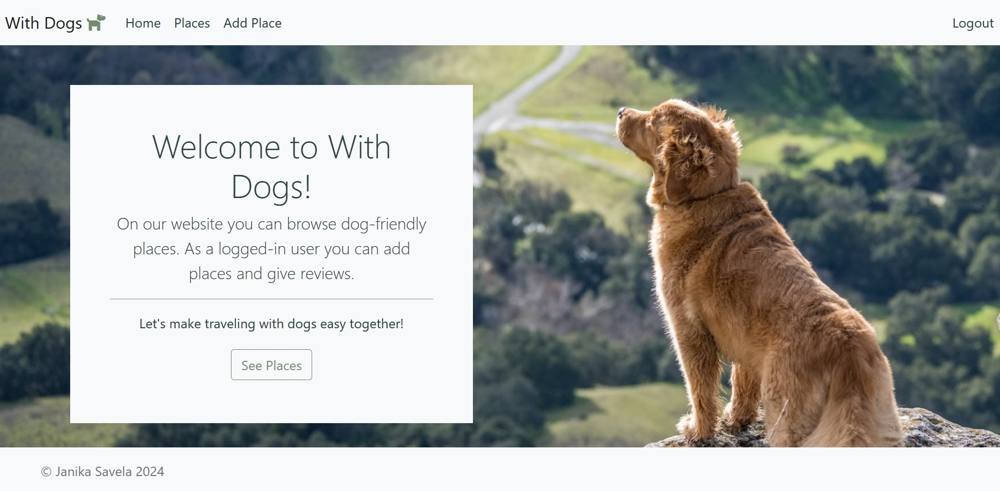
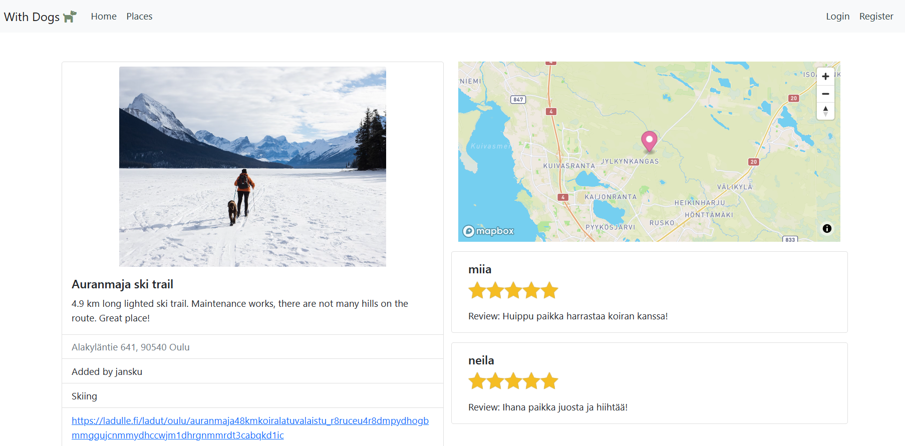
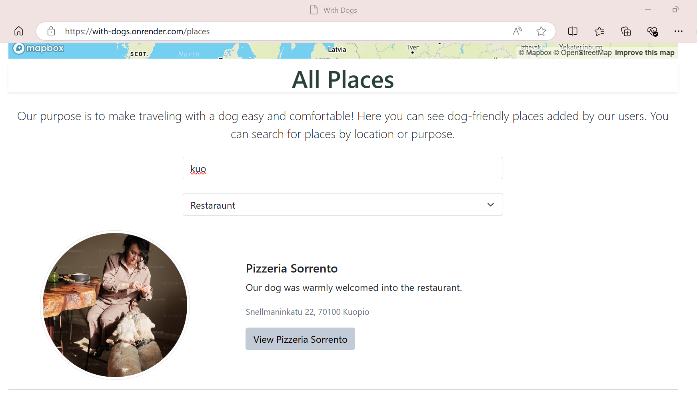

# With Dogs – karttapohjainen web-sovellus

## _Tekijä: Janika Savela_

## Esittely

With Dogs on Oulun ammattikorkeakoulun 4. vuoden projektikurssilla tekemäni suurehko web-sovellus. Sain ideoida itse aiheen, ja se lähti puhtaasti omasta tarpeesta. Minulla on kaksi koiraa, ja reissaan niiden kanssa paljon. Monesti tuolla tien päällä miettii että olisipa joku paikka mistä voisi näppärästi tarkistaa onko lähellä esimerkiksi ruokapaikkoja mihin voisi ottaa koirat mukaan. Kesällä koiria ei voi kuumaan autoon jättää hetkeksikään. Siispä sain idean tehdä sovelluksen, johon käyttäjät voivat lisäillä koiraystävällisiä paikkoja kartalle, ja niitä voi suodattaa näkymään itselle sopivin hakukriteerein.
Halusin tehdä sivustosta dynaamisen, mutta ilman Reactia, koska sillä olen yhden suurehkon web sovelluksen jo tehnyt. Käytin siis perinteisempiä keinoja ja sivujen reaaliaikainen päivitys ilman sivun uudelleenlatautumista on toteutettu puhtaasti Javascriptillä ja EJS tamplaattimoottorin avulla. Projekti oli melko laaja ja koodia tuli paljon, mutta nautin sen ideoimisesta ja työstämisestä. Web-kehitys kiinnostaa itseä paljon, ja uuden asian opettelua tuli tehtyä kivasti. Oli hyvä esimerkiksi perehtyä miten Javascriptillä mm. eventListener() functiolla napataan käyttäjän syötteitä, kun Reactilla on ollut hieman eri syntaksit.

##### Kuva 1: Käyttöliittymän etusivu

## Toiminnallisuudet ja teknologiat niiden takana

### Käyttöliittymä

Käyttöliittymän etusivulla (kuva 1) on pieni esittelyteksti sovelluksen tarkoituksesta sekä kuvat ja linkit paikkojen selailuun, rekisteröitymiseen ja kirjautumiseen. Places näkymässä avautuu iso kartta, jossa näkyy kaikki lisätyt koiraystävälliset paikat. Kartassa on kontrollerit helpottamassa sen liikuttelua. Myös kuvakkeet on mukautettu sivuille sopivaan teemaan. Kaukaa katsottuna näkyy isot pallot joissa näkyy kyseiselle alueelle lisättyjen paikkojen määrä. Kun karttaa klikkailee lähemmäksi, pallerot hajautuvat ja paikkojan tarkemmat sijainnit paljastuvat. Kuvakkeita klikatessa, avautuu paikan nimi, pieni esittelytekstin pätkä ja linkki paikan tarkempaa tarkastelua varten.
Kartan alapuolella on pari input-kenttää paikkojen suodattamista varten. Ylemmässä hakukentässä käyttäjä voi hakea paikkoja sijainnin tai nimen perusteella. Alemmasta valikosta voi valita kategorian. Hakukriteerit toimivat myös yhdessä, voit hakea esimerkiksi kauppoja alueelta Oulu. Paikat päivittynät näkymään dynaamisesti ilman sivun uudelleen latautumista tai minkäänlaista napin painallusta.
Paikka sivustolla näkyy allekkain kaikki lisätyt paikat, ja jokaisesta paikasta kuva, otsikko, pieni esittelyteksti sekä linkki mistä pääsee tarkastelemaan paikan tietoja tarkemmin. Linkistä avautuu sivu, jossa näkyy käyttäjän lisäämä kuva isompana sekä perustietojen lisäksi tarkemmat sijaintitiedot ja muun muassa yhteystiedot, jos käyttäjä on ne lisännyt. Rekisteröityneenä käyttäjänä pystyt myös arvostelemaan muiden lisäämiä paikkoja. Annetut arvostelut näkyvät myös kirjautumattomille käyttäjille.
Kartat ja lisätyt paikat näkyvät kaikille sovelluksen käyttäjille. Sivustolle voi kuitenkin myös rekisteröityä, ja rekisteröityneenä käyttäjänä voi lisätä paikkoja, muokata/poistaa lisäämiään paikkoja sekä antaa arvosteluja. Lisäämiään arvosteluja voi myös poistaa.
UI on responsiivinen eli käyttöliittymä skaalautuu, mikäli selaimen ikkunan kokoa muutetaan. Käyttöliittymän toteutuksessa on käytetty Bootstrap CSS-kehystä. Bootsrapin oletusvärejä olen muokannut SASS:in ja Koalaksen avulla itselle mieluisiksi.
Yläpalkista löytyvät linkit etusivulle, käyttäjän rekisteröitymiseen ja sovellukseen sisälle kirjautumiseen, sekä paikkojen selailuun. Kirjautuneena käyttäjänä navbar muokkautuu ja siihen tulee linkit paikkojen lisäämiseen sekä uloskirjautumiseen. Käyttäjä luodaan antamalla käyttäjätunnus, sähköposti ja salasana, jotka mahdollistavat kirjautumisen sovellukseen. Sivustolla olevien lomakkeiden lähettämisessä on tehty tarkkaa validaatiota. Jos käyttäjä yrittää mm rekisteröityä jo olemassa olevalla käyttäjänimellä, tulee siitä virheilmoitus. Myös kirjautumusyritykset jotka tehdään väärillä tiedoilla, antaa virhe ilmoituksen. Paikkojen lisäämisessä input-kentille on määritetty tarkat ehdot, minkälaisia syötteitä niiden avulla voidaan lähettää, jotta data menee tietokantaan oikeassa muodossa. Väärin täytettyjä lomakkeita ei pysty lähettämään. Käytännön testailussa en ole vielä saanut aikaan virhettä, joka johtaisi error-sivulle, mutta sellainen kuitenkin löytyy.

##### Kuva 2: Kartta

### Endpointit

Osa päätepisteistä kuten /places/new on salattu token-pohjaisella todennuksella. Tunnusteen käyttöiäksi on määritetty 120 minuuttia. Tämän jälkeen kirjautumistiedot tulee syöttää uudelleen, jos haluaa päästä käsiksi suojattuihin päätepisteisiin.

### Muu teknologia ja kehitysympäristö

Kehitysympäristönä toimi Visual Studio Code (kuva 3). Backend sekä frontend toteutettiin Node.js- ja Express.js- teknologioilla, joissa ohjelmointikielenä toimi Javascript. Muita käytettyjä ohjelmointikieliä oli HTML, CSS sekä EJS. Tietokantana toimi MongoDB. Versionhallintana GitHub-työympäristö.

##### Kuva 3: Paikan tarkemmat tiedot

### Projekti pilvipalvelussa

Sovellus on käyttöönotettu ja löytyy osoitteesta:
https://with-dogs.onrender.com/
Sivusto saattaa olla hieman hidas, koska se on julkaistu ilmaispalveluna Renderin kautta. Tietokantana julkaistussa versiossa toimii Mongo Atlas.

---

## Projektin testaus

Tavoitteena oli kirjoittaa projektin testit ohjelmistokoodiksi, mutta sen osalta minulla loppui aika kesken. Aion sen kuitenkin vielä tehdä ja testikoodit lisätä projektin kylkeen. Tein kuitenkin systeemitestausta, eli testasin projektia käsityönä. Yritin ottaa mahdolliset virhetilanteet huomioon koodissa ja virheenhallintaa tulikin tehtyä useampi tunti.

---

## Yhteenveto

##### Kuva 3: Paikan haku

Projektissa oli paljon tekemistä, mutta nautin sen työstämisestä suuresti. Myös oppimista ja kehittymistä tapahtui huomasti projektin aikana, ja paljon tuli perehdyttyä uusiin asioihin. Muun muassa MongoDB oli itselle ihan uusi työkalu, aiemmin käyttänyt tietokantana MySQL:lää. Lopputulokseen olen erittäin tyytyväinen. Mielestäni sivusto on helppo käyttää ja ymmärtää, toiminnallisuudet ovat näppärät ja toimivat sekä ulkoasu silmää miellyttävä. Vastaavaa palautetta olen saanut läheisiltäni, joille olen sovellusta esitellyt.
